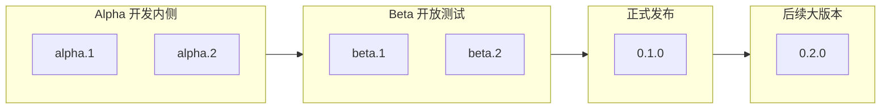

# log-uploader 版本管理规划

## 1. 项目概述

- **项目名称**：log-uploader
- **当前版本**：0.1.0
- **定位**：NestJS 通用日志上传模块，团队内部统一接入
- **核心能力**：Core / Http / Admin / Kafka（骨架）/ Grpc（骨架）

---

## 2. 版本生命周期总览

---

## 3. 阶段定义

| 阶段 | 版本格式 | 受众 | 目标 |
|------|----------|------|------|
| **Alpha** | `0.1.0-alpha.{id}` | 内部开发团队 | 功能开发、单元/集成测试、内部验证 |
| **Beta** | `0.1.0-beta.{id}` | 内部 + 可选外部试点 | 真实/类生产环境验证、问题收集 |

---

## 4. 0.1.0-alpha - 开发内侧

**目标**：补齐测试与内部验证，保证核心逻辑可验证。

**准入标准**：
- 引入 Jest + @nestjs/testing
- Core 测试：LogUploaderService、脱敏、标准化、存储适配器
- Http 测试：单条/批量上传、鉴权、健康检查
- Admin 测试：recent、by-trace-id、search、stats 查询逻辑
- `package.json` 增加 `test`、`test:watch` 脚本

**版本示例**：0.1.0-alpha.1（测试框架 + Core）、0.1.0-alpha.2（Http + Admin）

**退出条件**：所有测试通过，CI 可跑通，内部无阻塞问题

---

## 5. 0.1.0-beta - 开放测试

**目标**：在真实/类生产环境中验证，收集问题。

**准入标准**：
- 所有 alpha 测试通过
- 提供 demo 或 example 接入验证
- README、接口文档与实现一致
- 可选：E2E 接口测试

**版本示例**：0.1.0-beta.1（E2E + demo）、0.1.0-beta.2（问题修复）

**退出条件**：无 P0 问题，文档完整，问题已记录或修复

---

## 6. 0.1.0 - 正式发布

**准入标准**：
- 所有 alpha/beta 问题已修复
- 测试全部通过
- 文档完整（README、接口文档）
- 发布到 npm（若适用）

---

## 7. 版本号规范

- `0.1.0-alpha.{id}`：开发内侧，id 递增
- `0.1.0-beta.{id}`：开放测试，id 递增
- `0.1.0`：正式版
- `0.2.0`：限制优化大版本（见下节）

---

## 8. 0.2.0 - 已知限制优化

基于 README 第十五节「已知限制」与第十六节「后续规划」：

| 限制 | 0.2.0 优化方向 |
|------|----------------|
| Admin 仅支持 file storage | 抽象 Admin 查询接口，支持 Elasticsearch / DB 等适配 |
| cursor 轻量版，同 timestamp 可能重复/漏数据 | 引入复合游标（timestamp + 行号或 id） |
| 适合中小规模，不适合超大规模 | 分页与扫描策略优化，或接入 ES/Kafka |
| Admin 未做权限校验 | 增加 Admin 鉴权/权限校验 |
| 查询维度单一 | 支持按 userId / deviceId / module 查询 |
| 统计能力有限 | 按时间范围聚合统计 |
| Kafka / Grpc 为骨架 | 实现 Kafka / Grpc 真正接入 |

---

## 9. 补充内容

### 9.1 发布检查清单

- [ ] 所有测试通过
- [ ] 无敏感信息（密钥、token、.env 真实配置）
- [ ] CHANGELOG 已更新（如有）
- [ ] 版本号已更新（package.json）

### 9.2 版本推进原则

- alpha 内可多次迭代，直到满足退出条件
- beta 内可多次迭代，直到满足退出条件
- 正式版发布前需确认无已知 P0 问题

### 9.3 语义化版本（0.x 阶段）

- 0.x 表示初始开发阶段，API 可能不稳定
- 正式版 0.1.0 后，后续 patch 为 0.1.1、0.1.2
- 0.2.0 为 breaking change 或功能大版本
